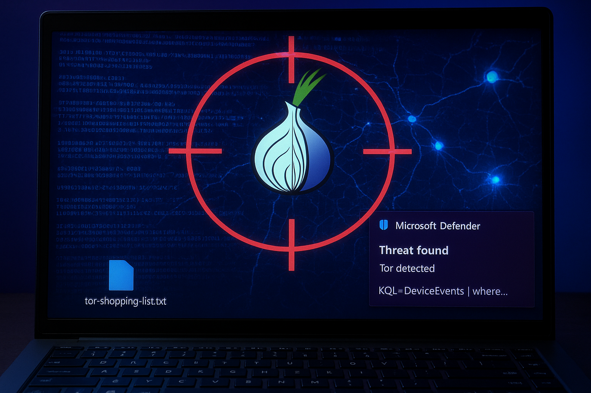
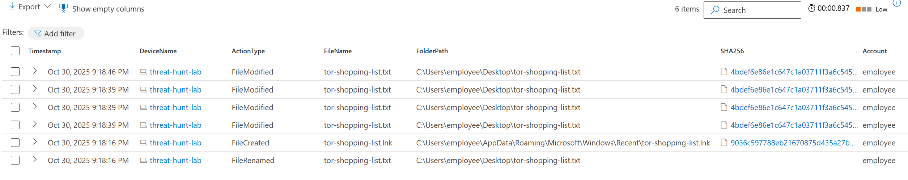
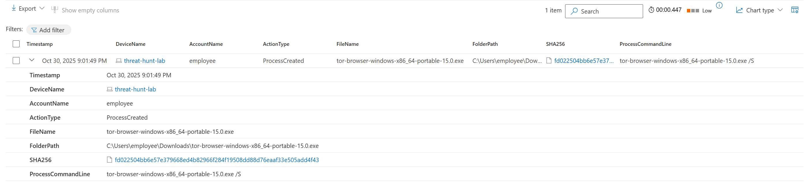
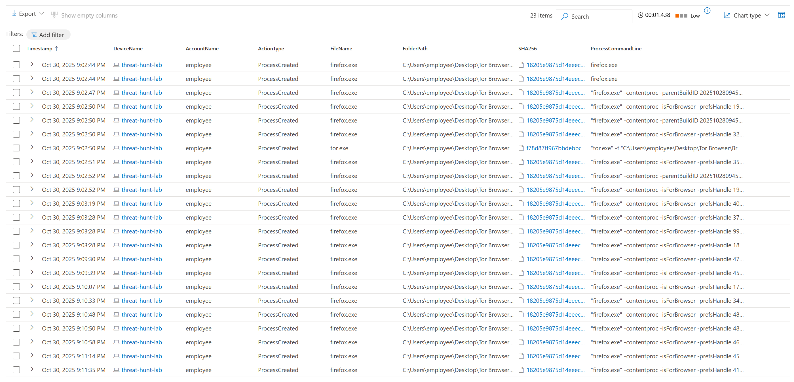
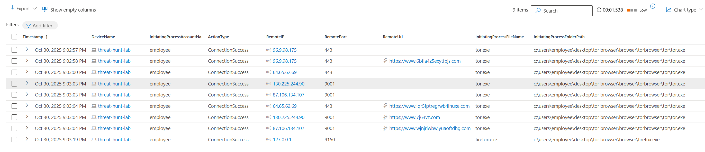

# Encrypted Traffic Detection Lab




# Threat Hunt Report: Unauthorized TOR Usage
- [Scenario Creation](https://github.com/PritomDas/encrypted-traffic-detection-lab/blob/main/encrypted-traffic-detection-lab-event-creation.md)

## Platforms and Languages Leveraged
- Windows 10 Virtual Machines (Microsoft Azure)
- EDR Platform: Microsoft Defender for Endpoint
- Kusto Query Language (KQL)
- Tor Browser

##  Scenario

Management suspects that some employees may be using TOR browsers to bypass network security controls because recent network logs show unusual encrypted traffic patterns and connections to known TOR entry nodes. Additionally, there have been anonymous reports of employees discussing ways to access restricted sites during work hours. The goal is to detect any TOR usage and analyze related security incidents to mitigate potential risks. If any use of TOR is found, notify management.

### High-Level TOR-Related IoC Discovery Plan

- **Check `DeviceFileEvents`** for any `tor(.exe)` or `firefox(.exe)` file events.
- **Check `DeviceProcessEvents`** for any signs of installation or usage.
- **Check `DeviceNetworkEvents`** for any signs of outgoing connections over known TOR ports.

---

## Steps Taken

### 1. Searched the `DeviceFileEvents` Table

Searched for any file that had the string "tor" in it and discovered what looks like the user "employee" downloaded a TOR installer, did something that resulted in many TOR-related files being copied to the desktop, and the creation of a file called `tor-shopping-list.txt` on the desktop.

**Query used to locate events:**

```kql
DeviceFileEvents  
| where DeviceName == "threat-hunt-lab"  
| where InitiatingProcessAccountName == "employee"  
| where FileName contains "tor"  
| where Timestamp >= datetime(2025-10-31T02:15:00.0000000Z) 
| order by Timestamp desc  
| project Timestamp, DeviceName, ActionType, FileName, FolderPath, SHA256, Account = InitiatingProcessAccountName
```



---

### 2. Searched the `DeviceProcessEvents` Table

Searched for any `ProcessCommandLine` that contained the string "tor-browser-windows-x86_64-portable-14.0.1.exe". Based on the logs returned, an employee on the "threat-hunt-lab" device ran the file `tor-browser-windows-x86_64-portable-15.0.exe` from their Downloads folder, using a command that triggered a silent installation.

**Query used to locate event:**

```kql

DeviceProcessEvents  
| where DeviceName == "threat-hunt-lab"  
| where ProcessCommandLine contains "tor-browser-windows-x86_64-portable-15.0.exe"  
| project Timestamp, DeviceName, AccountName, ActionType, FileName, FolderPath, SHA256, ProcessCommandLine
```


---

### 3. Searched the `DeviceProcessEvents` Table for TOR Browser Execution

Searched for any indication that user "employee" actually opened the TOR browser. There was evidence that they did open it . There were several other instances of `firefox.exe` (TOR) as well as `tor.exe` spawned afterwards.

**Query used to locate events:**

```kql
DeviceProcessEvents  
| where DeviceName == "threat-hunt-lab"  
| where FileName has_any ("tor.exe", "firefox.exe", "tor-browser.exe")  
| project Timestamp, DeviceName, AccountName, ActionType, FileName, FolderPath, SHA256, ProcessCommandLine  
| order by Timestamp desc
```


---

### 4. Searched the `DeviceNetworkEvents` Table for TOR Network Connections

Searched for any indication the TOR browser was used to establish a connection using any of the known TOR ports. An employee on the "threat-hunt-lab" device successfully established a connection to the remote IP address on port `9001`. The connection was initiated by the process `tor.exe`, located in the folder `c:\users\employee\desktop\tor browser\browser\torbrowser\tor\tor.exe`. There were a couple of other connections to sites over port `443`.

**Query used to locate events:**

```kql
DeviceNetworkEvents  
| where DeviceName == "threat-hunt-lab"  
| where InitiatingProcessAccountName != "system"  
| where InitiatingProcessFileName in ("tor.exe", "firefox.exe")  
| where RemotePort in ("9001", "9030", "9040", "9050", "9051", "9150", "80", "443")  
| project Timestamp, DeviceName, InitiatingProcessAccountName, ActionType, RemoteIP, RemotePort, RemoteUrl, InitiatingProcessFileName, InitiatingProcessFolderPath  
| order by Timestamp desc
```


---
## Chronological Event Timeline

### 1. Process Execution - TOR Installer

- **Timestamp:** `Oct 30, 2025, 9:01:49 PM Central time`
- **Event:** The user "employee" initiated the process `tor-browser-windows-x8664-portable-15.0.exe`.
- **Action:** Process creation detected.
- **File Path:** `C-browser-windows-x8664-portable-15.0.exe`
- **Command:** `tor-browser-windows-x8664-portable-15.0.exe S`

### 2. Process Execution - TOR Service Start

- **Timestamp:** `Oct 30, 2025, 9:02:50 PM Central time`
- **Event:** Process `tor.exe` for TOR Browser started by user "employee".
- **Action:** TOR proxy and SOCKS port initialized.
- **Command:** `tor.exe -f ... ControlPort 127.0.0.1:9151 ... SocksPort 127.0.0.1:9150 ...`
- **File Path:** `C Browser.exe`

### 3. Process Execution - TOR Browser Use

- **Timestamp:** `Oct 30, 2025, 9:02:44 PM – 9:11:35 PM Central time`
- **Event:** Multiple `firefox.exe` processes (TOR Browser) launched under user "employee".
- **Action:** Many Firefox browser sessions consistent with TOR usage.
- **File Path:** `C Browser.exe`
- **Command:** Various `firefox.exe -contentproc ...` args for browser tabs and operations.

### 4. Network Connection - TOR Network Established

- **Timestamps:**  
  - `Oct 30, 2025, 9:02:57 PM – 9:03:19 PM Central time`
- **Event:** TOR Browser (`tor.exe`) made network connections to external IPs (TOR relays/nodes).
- **Action:** Connection successes recorded.
- **Details:**  
  - Connected to `87.106.134.107` on port `9001`
  - Connected to `130.225.244.90` on port `9001`
  - Connected to `64.65.62.69` on port `443`
  - Local connection to `127.0.0.1` on port `9150`

### 5. File Creation/Modification - TOR Shopping List

- **Timestamp:** `Oct 30, 2025, 9:18:16 PM – 9:18:46 PM Central time`
- **Event:** The file `tor-shopping-list.txt` and link `tor-shopping-list.lnk` created/modified/renamed.
- **Action:** The user "employee" created and managed a file possibly documenting TOR activity.
- **File Path:** `C-shopping-list.txt`, `C-shopping-list.lnk`

---


---

## Summary

The user "employee" on the "threat-hunt-lab" device initiated and completed the installation of the TOR browser. They proceeded to launch the browser, establish connections within the TOR network, and created various files related to TOR on their desktop, including a file named `tor-shopping-list.txt`. This sequence of activities indicates that the user actively installed, configured, and used the TOR browser, likely for anonymous browsing purposes, with possible documentation in the form of the "shopping list" file.

---

## Response Taken

TOR usage was confirmed on the endpoint `threat-hunt-lab` by the user `employee`. The device was isolated, and the user's direct manager was notified.

---
